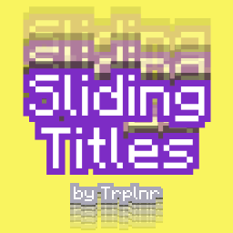

# Sliding Titles by Trplnr
- Makes your ordinary vanilla titles have a nice refreshing sliding animation thats configurable (instructions below)!

## Configuration:
If you havent extracted the .zip yet, now is the best time to do so.

I recommend opening up a world and having this command ready in your clipboard: `/title @s title "Test Title"`

### Steps:
- Go inside the resource pack and locate `assets/minecraft/shaders/core/rendertype_text.vsh` then open it.
- Scroll down a bit and you will see a massive block of text that has "CONFIGURATION" on it.
- Simply read it and edit the values it has provided.
- Once you are done editing, do `F3+T` to reload the pack and run a title command like what I provided at the top and see if you like it. You can tweak it to your liking until you get the result you want.
